# Media Homelab

A self-contained Docker Compose media stack — qBittorrent, Prowlarr, Sonarr,
Radarr, Bazarr, Jellyfin, and Seerr — sitting behind a Caddy reverse
proxy on a private Docker network, with an optional VPN-routed mode via
Gluetun for qBittorrent, Prowlarr, and Byparr.

```mermaid
flowchart TB
 subgraph VPNNet["Gluetun Network Namespace"]
        Gluetun("Gluetun VPN Gateway")
        qBittorrent("qBittorrent")
        Prowlarr("Prowlarr")
        Byparr("Byparr")
  end
 subgraph DockerNet["Docker Network: homelab_net"]
        Jellyfin("Jellyfin")
        Seerr("Seerr")
        Homepage("Homepage")
        Sonarr("Sonarr")
        Radarr("Radarr")
        Bazarr("Bazarr")
        Recyclarr("Recyclarr")
        VPNNet
  end
 subgraph Host["Local Host Machine"]
        Caddy("Caddy Reverse Proxy")
        OAuth2("OAuth2-Proxy")
        GoogleSSO(("Google SSO"))
        DockerNet
        MediaStorage[("/opt/media-data")]
  end
    Internet(("Internet")) -- HTTPS (Port 443) --> Caddy
    Caddy -- Auth Callback --> OAuth2
    OAuth2 -. OAuth2 Flow .-> GoogleSSO
    qBittorrent --- Gluetun
    Prowlarr --- Gluetun
    Byparr --- Gluetun
    Caddy -- SSO Protected --> Homepage & Seerr
    Caddy -- Native Auth --> Jellyfin & Sonarr & Radarr & Bazarr & qBittorrent & Prowlarr
    Gluetun == WireGuard Tunnel ==> VPNServer(("VPN Server"))
    Prowlarr -. Bypass Captchas .-> Byparr
    Recyclarr -. Sync Configs .-> Sonarr & Radarr
    Jellyfin -. Read Only .-> MediaStorage
    Sonarr --> MediaStorage
    Radarr --> MediaStorage
    Bazarr --> MediaStorage
    qBittorrent --> MediaStorage

     Gluetun:::vpn
     qBittorrent:::app
     Prowlarr:::app
     Byparr:::app
     Jellyfin:::app
     Seerr:::app
     Homepage:::app
     Sonarr:::app
     Radarr:::app
     Bazarr:::app
     Recyclarr:::app
     Caddy:::proxy
     OAuth2:::proxy
     GoogleSSO:::external
     MediaStorage:::storage
     Internet:::external
     VPNServer:::external
    classDef proxy fill:#2e6da4,stroke:#171d2c,stroke-width:2px,color:#fff
    classDef app fill:#3f5fe0,stroke:#171d2c,stroke-width:1px,color:#fff
    classDef vpn fill:#8b5cf6,stroke:#171d2c,stroke-width:2px,color:#fff
    classDef storage fill:#171d2c,stroke:#262f45,stroke-width:2px,color:#e8ebf3
    classDef external fill:#f4f6fb,stroke:#5b6480,stroke-width:1px,stroke-dasharray: 5 5,color:#1a2036
    style Gluetun fill:#5b6480
    style qBittorrent fill:#171d2c
    style Prowlarr fill:#171d2c
    style Byparr fill:#171d2c
    style VPNNet fill:#757575
    style GoogleSSO fill:#FFCDD2
    style DockerNet fill:#616161
    style Internet fill:#C8E6C9
    style Host fill:#424242
```



## Services

| Service | Purpose | LAN address (via Caddy) |
|---|---|---|
| qBittorrent | Torrent client | `qbittorrent.media.lan` |
| Gluetun | VPN gateway for qBittorrent/Prowlarr/Byparr (optional) | — |
| Prowlarr | Indexer manager | `prowlarr.media.lan` |
| Sonarr | TV show automation | `sonarr.media.lan` |
| Radarr | Movie automation | `radarr.media.lan` |
| Bazarr | Subtitle automation | `bazarr.media.lan` |
| Jellyfin | Media server | `jellyfin.media.lan` |
| Seerr | Media request UI | `seerr.media.lan` |
| Byparr | Cloudflare/anti-bot bypass for Prowlarr indexers | — |
| Recyclarr | Syncs TRaSH Guides quality profiles/custom formats into Sonarr/Radarr | — |
| Homepage | Dashboard with live widgets for the whole stack | `status.media.lan` |
| Caddy | Reverse proxy / gateway, plus a static landing page | `:80` / `:443` |
| *(landing page)* | Tile grid linking to every service above | `homepage.media.lan` |
| Tailscale | Optional remote access over a private mesh network (see Setup step 5) | `<node>.<tailnet>.ts.net` |

All services communicate over an internal `homelab_net` bridge network.
Caddy is the only intended ingress point; a few services (qBittorrent,
Jellyfin) also publish ports directly for LAN discovery/native app use.

## Prerequisites

- Docker Engine + Docker Compose plugin
- `python3` with the `PyYAML` package (`pip install -r scripts/requirements.txt`)
  — used by `scripts/setup.sh`. On Debian/Ubuntu-based systems this may fail
  with an "externally managed environment" error; use `apt install
  python3-yaml`, `pip install --user -r scripts/requirements.txt`, or a venv
  instead.
- A host directory for media/downloads (default: `/opt/media-data`, mounted
  read-write into qBittorrent/*arr and read-only into Jellyfin)
- LAN DNS entries (or hosts-file entries) resolving `*.media.lan` to this
  host, or edit `caddy/Caddyfile` to suit your own domain

## Setup

1. Copy the environment template and fill in real values:

   ```bash
   cp .env.example .env
   ```

2. Choose network mode by setting `COMPOSE_PROFILES` in `.env`:
   - `novpn` — qBittorrent/Prowlarr/Byparr all connect directly (default, no
     extra config)
   - `vpn` — all three are routed through Gluetun instead

   Both modes are always reachable at the same hostnames (`qbittorrent`,
   `prowlarr`, `byparr` on `homelab_net`, plus `qbittorrent:8080` published
   to the LAN), so nothing downstream needs to change when you switch.
   `vpn` mode is mainly useful for indexers `setup.sh` reports as
   unreachable due to an ISP/network-level block rather than a
   Cloudflare-style challenge (which Byparr alone already handles) - note
   that in this mode, Prowlarr (and anything that depends on reaching it,
   like Sonarr/Radarr's indexer sync and its Caddy route) goes down if the
   VPN tunnel does, which isn't a concern in `novpn` mode.

   For `vpn` mode, Gluetun (the container that runs the tunnel) supports 30+
   VPN providers — see `.env.example` for ready-to-uncomment blocks for
   **Private Internet Access** (default, WireGuard, supports port
   forwarding), **ProtonVPN** (WireGuard, also supports port forwarding on
   paid plans), and **Mullvad** — all three have solid no-logging track
   records and work cleanly through Gluetun. Any other provider Gluetun
   supports (NordVPN, Surfshark, AirVPN, Windscribe, ...) works the same
   way: set `VPN_SERVICE_PROVIDER` to that provider's Gluetun name and fill
   in whichever variables its page on the
   [Gluetun wiki](https://github.com/qdm12/gluetun-wiki/tree/main/setup/providers)
   calls for — the compose file's `gluetun` service reads Gluetun's own
   variable names directly, so nothing else needs to change.

   With port forwarding on, `setup.sh` also keeps qBittorrent's listening
   port in sync with whatever port the VPN provider forwards (see
   `scripts/gluetun-port-forward-hook.sh`) - without this, incoming peer
   connections silently can't reach you, which hurts speed on
   less-popular torrents. Since `qbittorrent-vpn`/`prowlarr-vpn`/`byparr-vpn`
   share Gluetun's network namespace, they also go unreachable (though
   still shown "running") whenever Gluetun's own container restarts -
   `scripts/gluetun-watchdog.sh` + `systemd/gluetun-watchdog.service` restart
   them automatically when that happens. Install it once with:
   ```
   mkdir -p ~/.config/systemd/user
   cp systemd/gluetun-watchdog.service ~/.config/systemd/user/
   systemctl --user daemon-reload
   systemctl --user enable --now gluetun-watchdog.service
   sudo loginctl enable-linger "$USER"   # keeps it running without a login session
   ```

3. Bring up and configure the stack:

   ```bash
   docker compose up -d
   ./scripts/setup.sh
   ```

   `scripts/setup.sh` brings the containers up (if not already) and then
   wires them together via each app's API: Sonarr/Radarr get their root
   folders, qBittorrent download client, and Prowlarr indexers; Bazarr gets
   connected to Sonarr/Radarr with an English subtitle profile; Jellyfin's
   setup wizard is completed with your Movies/TV libraries; Seerr signs
   in through Jellyfin and connects to Sonarr/Radarr. It prompts for a
   shared admin username/password if `ADMIN_USERNAME`/`ADMIN_PASSWORD`
   aren't set in `.env` or in `~/secrets/homelab.sh` (a plain
   `ADMIN_USERNAME=...`/`ADMIN_PASSWORD=...` shell file outside this repo,
   for running it unattended), and picks a curated set of public indexers unless
   `PROWLARR_INDEXERS` says otherwise (see `.env.example`). It's safe to
   re-run — every step checks current state first and skips what's already
   configured. Requires `python3` with the `PyYAML` package (`pip install
   -r scripts/requirements.txt`) in addition to Docker.

   Any indexer that fails to add on the first attempt is retried once
   through Byparr, a Cloudflare/anti-bot bypass proxy Prowlarr talks to via
   its own "FlareSolverr"-compatible indexer proxy type — this only helps
   indexers behind a Cloudflare JS challenge, not sites blocked at the
   network/DNS/ISP level (no in-network proxy can bypass that; a VPN would
   be needed instead).

   Sonarr/Radarr also get a Recyclarr config generated from a curated
   TRaSH Guides quality-profile template (`recyclarr.sonarr_template`/
   `radarr_template` in `stack.yaml`), synced once immediately and then
   kept current on Recyclarr's own daily cron schedule with no further
   help from this script.

   Finally, a Homepage dashboard (`status.media.lan`) is generated with live
   widgets for every service above, wired up using the same API keys this
   script already collected. It's only generated once - the file
   (`config/homepage/services.yaml`) is left alone on later runs, so you can
   freely rearrange it by hand afterward. `homepage.media.lan` itself is a
   separate, simple static landing page (`caddy/site/index.html`) with a
   tile per service, meant as the everyday starting point for anyone on the
   LAN - Homepage's own dashboard app can't be served under a subpath of
   the same domain (a known upstream limitation), hence the two different
   addresses.

   The script is split by service for easy maintenance:
   - `scripts/config/stack.yaml` — ports, paths, default indexers, category
     IDs, and other values you're likely to want to tweak. Change behavior
     here before touching any script.
   - `scripts/config/bazarr-language-profile.json` — the English subtitle
     profile payload Bazarr gets configured with.
   - `scripts/lib/api.py` — all JSON/YAML parsing lives here as small,
     documented subcommands, rather than inline `python3 -c "..."` in bash.
   - `scripts/lib/common.sh` — shared logging/polling/docker-exec helpers.
   - `scripts/lib/servarr.sh` — building blocks shared by Sonarr and Radarr
     (near-identical *arr APIs): auth, root folder, download client.
   - `scripts/lib/<service>.sh` — one file per service (`sonarr.sh`,
     `radarr.sh`, `prowlarr.sh`, `qbittorrent.sh`, `bazarr.sh`,
     `jellyfin.sh`, `seerr.sh`, `recyclarr.sh`, `homepage.sh`), each
     exposing a single `configure_<service>` entry point. `setup.sh`
     itself is just the orchestrator that sources these and calls them in
     order.

4. Add hosts-file entries (or LAN DNS records) pointing `*.media.lan` at
   this machine so Caddy's reverse proxy addresses resolve, then visit
   `https://homepage.media.lan` to get a tile for every service (or go
   straight to `https://sonarr.media.lan` etc.) and log in with the admin
   credentials from step 3. Your browser will warn about an untrusted
   certificate until you install Caddy's local CA root certificate — see
   TLS below.

5. **Optional: remote access via Tailscale.** Everything above is LAN-only.
   To reach the stack from anywhere, authorized via your Google (or GitHub/
   Microsoft) account, without exposing any public ports or DNS:

   - Create a free account at [tailscale.com](https://tailscale.com) if you
     don't have one, and sign in with Google - this is device-level tailnet
     membership (only devices you've authorized this way can reach
     anything below), not per-request app authentication like the
     OAuth2-Proxy diagram at the top of this README describes - a
     materially simpler model, well suited to "just let me and my household
     in from anywhere."
   - In the admin console, enable **HTTPS Certificates** under *DNS* /
     *Settings* if not already on - required for the automatic per-node
     certificates below.
   - Generate an auth key (*Settings → Keys → Generate auth key* -
     reusable, not ephemeral, is easiest) and add it as a new line in
     `~/secrets/homelab.sh` (the same file used for
     `ADMIN_USERNAME`/`ADMIN_PASSWORD` - see step 3):
     ```
     TS_AUTHKEY=tskey-...
     ```
   - Bring it up: `docker compose up -d tailscale` (or a full
     `./scripts/setup.sh` run, which exports `TS_AUTHKEY` for you). If no
     key was found, `docker logs tailscale` prints a one-time login URL
     instead - open it and sign in.
   - `tailscale/serve-config.json` declares what's reachable and gets a
     real, publicly-trusted certificate automatically (Tailscale's
     `${TS_CERT_DOMAIN}` placeholder resolves to this node's own MagicDNS
     name) - by default the landing page, Jellyfin, Seerr, qBittorrent, and
     the Homepage status dashboard, matching the LAN scope above. Edit it
     to add or remove services; each needs its own port (path-based routing
     on one port doesn't work for apps like Homepage that hardcode
     root-relative asset paths - see the landing-page/status-dashboard split
     above for why).
   - Once authenticated, find your node's MagicDNS name (`docker exec
     tailscale tailscale status`, or the admin console) and add
     `<name>:3000` to `HOMEPAGE_ALLOWED_HOSTS` in `docker-compose.yml`
     (comma-separated), then `docker compose up -d homepage` once - Homepage
     rejects requests whose `Host` header isn't an exact match including the
     port, and this hostname can't be known ahead of time.
   - If a Tailscale URL fails to connect from a device that also runs
     another VPN client (ProtonVPN, etc.), that's very likely the cause,
     not this stack - confirmed live in this project's own setup: a second
     VPN's routing can capture traffic meant for Tailscale's own tunnel
     even with its kill switch off. Disconnecting the other VPN (or setting
     up split-tunneling to exclude Tailscale, if it supports that) resolves
     it.
   - From any device signed into the same tailnet:
     `https://media-stack.<your-tailnet>.ts.net` (landing page) and
     `:8096`/`:5055`/`:8080`/`:3000` for the rest - no certificate warnings,
     no DNS setup, works the same on cellular data as at home.

## Notes

- Per-service state lives under `./config/<service>/` (git-ignored).
- `.env` holds secrets and is git-ignored — only `.env.example` is
  committed.
- **TLS**: `*.media.lan` isn't a real, publicly-resolvable domain, so it can
  never get a publicly-trusted Let's Encrypt certificate. The Caddyfile's
  `local_certs` option tells Caddy to self-sign one from its own internal CA
  instead — you still get real HTTPS (with an automatic HTTP→HTTPS
  redirect), but every device needs that CA's root certificate installed as
  trusted, or it'll show a certificate warning.

  After bringing the stack up, grab the root certificate with:

  ```bash
  docker cp caddy:/data/caddy/pki/authorities/local/root.crt ./config/caddy/local-ca-root.crt
  ```

  Then install it as a trusted root CA:
  - **Windows**: double-click the file → *Install Certificate* → *Local
    Machine* → *Place all certificates in the following store* → *Trusted
    Root Certification Authorities*.
  - **macOS**: double-click to add to Keychain Access, then find it and set
    *When using this certificate* to *Always Trust*.
  - **Android**: Settings → Security → *Encryption & credentials* → *Install
    a certificate* → *CA certificate*.
  - **iOS**: AirDrop or email yourself the file, install the resulting
    profile under Settings → *General* → *VPN & Device Management*, then
    enable full trust for it under Settings → *General* → *About* →
    *Certificate Trust Settings*.
  - **Linux**: copy it to `/usr/local/share/ca-certificates/`
    (as a `.crt` file) and run `sudo update-ca-certificates`; Firefox keeps
    its own certificate store separate from the OS, so it also needs
    importing under `about:preferences#privacy` → *View Certificates* →
    *Authorities* → *Import*.

  Some devices — smart TVs, some mobile apps — can't accept a custom CA at
  all. For those, keep using qBittorrent's/Jellyfin's/Seerr's own published
  ports directly (`http://<lan-ip>:8080`, `:8096`, `:5055`) instead of the
  Caddy route - e.g. the official Jellyfin app on an Android TV, which
  doesn't use the OS's user-added CA trust store the way a browser does.

  If you'd rather have genuinely publicly-trusted certificates with no
  per-device setup, and you own a domain on a DNS provider Caddy supports,
  swap `local_certs` for an `email` directive and a
  [DNS-challenge provider module](https://caddyserver.com/docs/automatic-https#dns-challenge)
  instead — the domain never needs to be internet-reachable, it's only used
  to prove ownership for the certificate.

- **LAN access from other devices (phones, smart TVs, etc.)**: those direct
  ports need to be reachable from the rest of your LAN, not just this
  machine. If this host runs under **WSL2 with mirrored networking**
  (`networkingMode=mirrored` in `.wslconfig`) - which shares the Windows
  host's real IP instead of a separate NAT'd one - Docker's published ports
  are already on that shared IP, but Windows Firewall still blocks other
  devices from reaching them until you add inbound allow rules (run as
  Administrator; scoped to the `Private` profile so nothing gets exposed via
  a VPN's own virtual adapter, which Windows typically marks `Public`):
  ```powershell
  New-NetFirewallRule -DisplayName "Homelab - Jellyfin" -Direction Inbound -Protocol TCP -LocalPort 8096 -Profile Private -Action Allow
  New-NetFirewallRule -DisplayName "Homelab - Jellyfin Discovery" -Direction Inbound -Protocol UDP -LocalPort 7359 -Profile Private -Action Allow
  New-NetFirewallRule -DisplayName "Homelab - Seerr" -Direction Inbound -Protocol TCP -LocalPort 5055 -Profile Private -Action Allow
  New-NetFirewallRule -DisplayName "Homelab - qBittorrent WebUI" -Direction Inbound -Protocol TCP -LocalPort 8080 -Profile Private -Action Allow
  New-NetFirewallRule -DisplayName "Homelab - Landing Page" -Direction Inbound -Protocol TCP -LocalPort 8888 -Profile Private -Action Allow
  ```
  The landing page itself (normally `homepage.media.lan`, see above) is also
  reachable this way at `http://<lan-ip>:8888` - plain HTTP on its own port,
  no hostname/DNS/certificate needed, for devices that can't resolve
  `*.media.lan` or don't accept the local CA.
  Test from an *actual other device* (phone browser, the TV app), not from
  this machine testing its own LAN IP — Windows commonly fails to "hairpin"
  a connection back to its own external address, which looks identical to a
  real block but isn't one.
